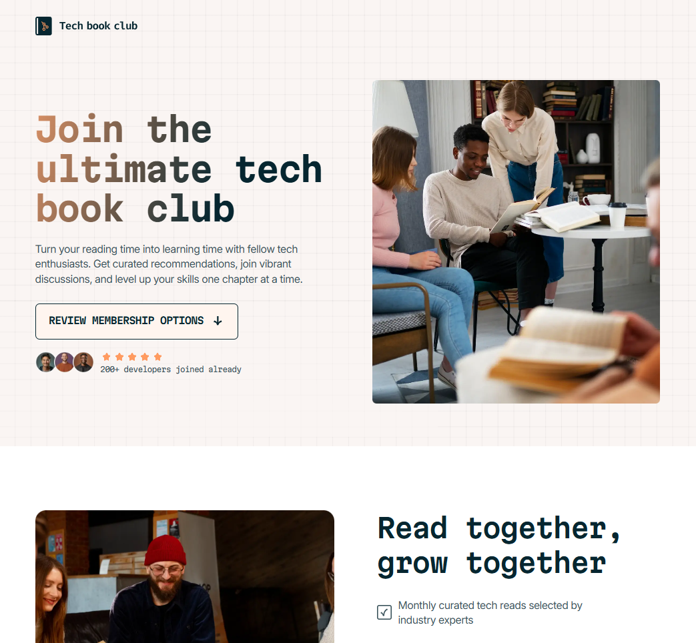
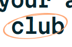

# Frontend Mentor - Tech book club landing page solution

This is a solution to the [Tech book club landing page challenge on Frontend Mentor](https://www.frontendmentor.io/challenges/tech-book-club-landing-page-fZQidjHU73). Frontend Mentor challenges help you improve your coding skills by building realistic projects.

## Table of contents

- [Overview](#overview)
  - [The challenge](#the-challenge)
  - [Screenshot](#screenshot)
  - [Links](#links)
- [My process](#my-process)
  - [Built with](#built-with)
  - [What I learned](#what-i-learned)
  - [Continued development](#continued-development)
  - [Useful resources](#useful-resources)
- [Author](#author)

## Overview

### The challenge

Users should be able to:

- View the optimal layout for the interface depending on their device's screen size
- See hover and focus states for all interactive elements on the page

### Screenshot



### Links

- Solution URL: [Frontend Mentor](https://www.frontendmentor.io/solutions/flexbox-css-grid-css-variables-FNtCWQH2Wt)
- Live Site URL: [Tech Book Club Landing Page](https://jezzydev.github.io/tech-book-club-landing-page/)

## My process

### Built with

- Semantic HTML5 markup
- Flexbox
- CSS Grid
- Responsive Web Design

### What I learned

I can replace a list’s list style counter with an image. Some ways to do it are:

- Via list-style-image property.
- Via ::before pseudo-element, then assigning an image to the content property.
- Via adding a small-sized version of the image as a background image of the <li> element, positioning it at the far left where the counter should be. Then set a left-padding so the text will not overlap with the image. This seems hacky, but it worked.

```css
.features-list li {
  padding-left: 40px;
  background-image: var(--icon-check);
  background-position: 0 center;
  background-size: 28px 28px;
  background-repeat: no-repeat;
}
```

To put an image with customaziable width and height **over** a text (as in the ff screenshot)


I can:

- Wrap the  element and the text in a <span>. Set the image's position to absolute and z-index to a higher number. The parent container should have its display set to inline-block.

```html
<span class="encircle-container"
  >club</span
>
```

```css
.encircle-container {
  position: relative;
  display: inline-block;
}

.encircle {
  position: absolute;
  width: 160px;
  height: 66px;
  z-index: 99;
  left: -18px;
}
```

### Continued development

@media queries for RWD
Efficient and effective way of creating and organizing CSS styles for reuse

### Useful resources

- [MDN](https://developer.mozilla.org/en-US/docs/Web/CSS) - This helped me for any CSS properties whose syntax and/or usage I am not familiar with or may have forgotten.

## Author

- Frontend Mentor - [@jezzydev](https://www.frontendmentor.io/profile/jezzydev)
